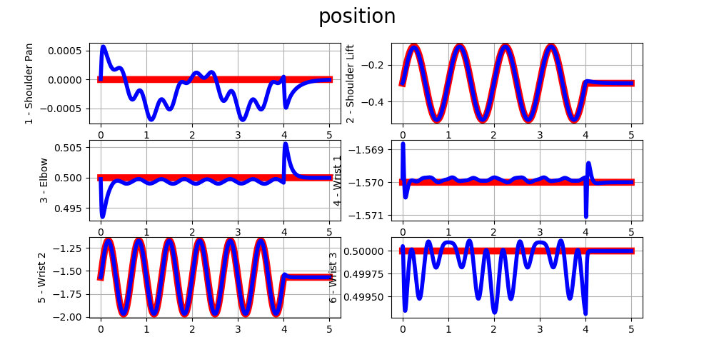

## LAB 2: Joint Space Motion Control Lab: Control of a 6-DoF Serial Manipulator
## José Yecid Moreno Villamizar : 11195127
---
## **1. Decentralized control (Lecture G0)**
## 1.1 - Sinusoidal reference generation:

$$\mathbf{q^{d}} =  \mathbf{q_0}+ \mathbf{A} \cdot \sin\left( \mathbf{\omega} \cdot t + \mathbf{\phi}\right)$$

$$\mathbf{\dot q^{d}} = \frac{d}{dt}\left(
    \mathbf{q_0}+\mathbf{A} \cdot \sin \left(\mathbf{\omega} * t  + \mathbf{\phi}\right)
    \right) = 
\mathbf{A} \cdot \mathbf{\omega} \cdot  \cos \left(\mathbf{\omega}\cdot t + \mathbf{\phi} \right)$$

$$\mathbf{\ddot q^{d}}\frac{d}{dt}\left(
    \mathbf{A} \cdot \mathbf{\omega} \cdot  \cos \left(\mathbf{\omega}\cdot t  + \mathbf{\phi} \right)
    \right) = 
-\mathbf{A} \cdot \mathbf{\omega}^{2} \cdot  \sin \left(\mathbf{\omega}\cdot t  + \mathbf{\phi} \right)$$

Aonde:
$$\mathbf{\omega} = 2 \cdot pi \cdot \mathbf{freq}$$

Os termo $\mathbf{q_0}$ faz referência a posição atual do robô, o objetivo é que a sinal gerada tenha início no ponto atual do robô para evitar um início suave por parte do robô. As constantes $\mathbf{A}$ , $\mathbf{freq}$ e $\mathbf{\phi}$ são vetores que contem cada uno dos valores configurados por junta.

```Python
amp = np.array([ 0.0, 0.2, 0.0, 0.0, 0.4, 0.0])  
phi = np.array([ 0.0, 0.0, 0.0, 0.0, 0.0, 0.0])    
freq = np.array([ 0.0, 1.0, 0.0, 0.0, 1.5, 0.0]) 

q_des   = q0 + amp*np.sin(two_pi_f*time + phi)
qd_des  = two_pi_f_amp * np.cos(two_pi_f*time + phi);
qdd_des = - two_pi_f_squared_amp * np.sin(two_pi_f*time + phi);
```
No seguinte gráfico podem se olhar as trajetórias desejadas em vermelho, com os parâmetros ajustados de acordo.


## 1.2 - Step reference generation:

Para a geração do step foi usado um *if* descrevendo uma função a pedaços, aonde os primeiros dois segundos são mantidos a posição atual e com velocidade e aceleração desejadas nulas, ficando o algoritmo no Python da seguinte forma:

```Python
if time > 2.0:
    q_des = conf.q0 + conf.amp
    qd_des =  zero
    qdd_des = zero
else:
    q_des = conf.q0
    qd_des =  zero
    qdd_des = zero
```

No seguinte gráfico podem se olhar as trajetórias desejadas em vermelho, com os parâmetros ajustados de acordo.


## 1.3 - Joint PD control:
Conhecendo que a lei de controle para um controlador PD é simplesmente calcular o erro de posição e velocidade multiplicados por um ganho, cujas unidades no final dos cálculos serão as mesmas do Torque [$N \cdot m$], de tal forma que:

$$\tau = \mathbf{K_p}\times(\mathbf{\dot q^d} - \mathbf{\dot q}) +
          \mathbf{K_d}\times(\mathbf{q^d} - \mathbf{q})$$

Sendo que $\mathbf{K_p}$ e $\mathbf{K_d}$ são matrizes diagonais com cada um dos ganhos correspondentes por junta.

Os resultados são medianamente esperados esperados, na $\mathbf{j_2}$, pois o controle não possui compensação de gravidade y por tal motivo apresenta erro de regímen e um offset no atuador. O comportamento da $\mathbf{j_5}$ os fenômenos anteriores são quase imperceptíveis, pois tem o objetivo de controlar os dois últimos graus de liberdade, porem carrega menos inercia e é mais fácil de estabilizar, mas o atuador consegue acompanhar a freqüência, deixando a um lado o seguimento de amplitude.
    
> É facilmente perceptível que os movimentos efetuados pelos atuadores fazem que aos outras juntas que em teoria não deveriam ter deslocamento tenham um comportamento diferente, causado pela propagação do movimento.


Enquanto o comportamento na referência Step, é facilmente perceptível que a $\mathbf{j_2}$ possui um erro de regímen a diferença de $\mathbf{j_5}$ que tem um comportamento criticamente amortecido.


## 1.4 - Joint PD control – high gains:
Neste ponto, são aumentados os valores de $\mathbf{K_p}$ para $600 Nm/rad$, obtendo um erro de regímen menor nos dois tipos de referência desejada, o problema de solucionar o erro de regímen neste caso só aumentando o valor de $K_p$ é que na hora de sair da simulação e levar para a realidade, as limitações mecânicas e elétricas não serão suficientes.


## 1.5 - Joint PD control critical damping

Usando a seguinte equação, podemos calcular os valores de amortecimento que levam a um comportamento criticamente amortecido.
$$\mathbf{K_d} = 2\cdot \sqrt{\mathbf{K_p} \times \mathbf{M(q)}}$$
Ainda se mantem o erro de regímen anterior, pois a gravidade ainda está aplicando forças sobre o atuador.


## 1.6 - Joint PD control + Gravity Compensation
Até o momento temos um controlador PD convencional, agora vai ser acrescentado um novo termo $\mathbf{G(q)}$, que indica qual é a força aplicada pela gravidade em cada junta, si colocam este termo somando, os efeitos da gravidade serão compensados

$$\tau = \mathbf{K_p}\times(\mathbf{\dot q^d} - \mathbf{\dot q}) +
          \mathbf{K_d}\times(\mathbf{q^d} - \mathbf{q}) + \mathbf{G(q)}$$

Como era esperado o offset que se tinha nos testes passados, sumiram e o acompanhamento da trajetória é mais acorde na referência.


## 1.7 - Joint PD + gravity + Feed-Forward term
Esperando desacoplar dinamicamente as juntas, para evitar movimentos indesejados, é usado um Feed-Foward $\mathit{ff}$ para compensar os efeitos entre cada uns dos atuadores, permitindo um controle mais simples por cada atuador. O jeito de dar solução é dado pela seguinte equação:

$$\tau_{fb} = \mathbf{K_p}\times(\mathbf{\dot q^d} - \mathbf{\dot q}) +
          \mathbf{K_d}\times(\mathbf{q^d} - \mathbf{q})$$
$$\tau_{ff} = \mathbf{M(q)} \times (\mathbf{\ddot{q} + \tau_{fb}})$$
$$\tau = \tau_{fb} + \tau_{ff}$$

O resultado é simplesmente satisfatório, pois foram quase eliminados os efeitos de propagação de movimento por parte das outras juntas.


