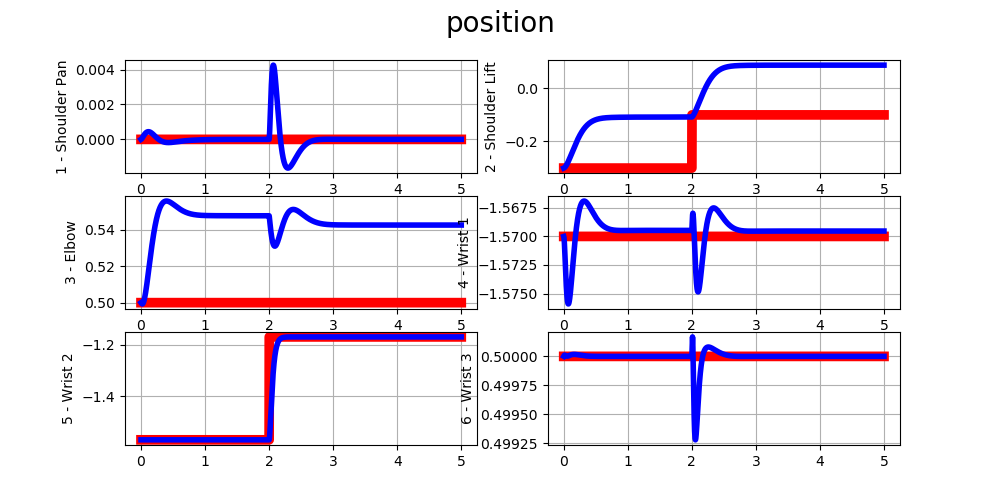

## LAB 2: Joint Space Motion Control Lab: Control of a 6-DoF Serial Manipulator
## José Yecid Moreno Villamizar : 11195127
---
## **1. Decentralized control (Lecture G0)**
## 1.1 - Sinusoidal reference generation:

$$\bold{q^{d}} =  \textbf{q_0}+ \bold{A} \cdot \sin\left( \bold{\omega} \cdot t + \bold{\phi}\right)$$
$$\bold{\dot q^{d}} = \frac{d}{dt}\left(
    \bold{q_0}+\bold{A} \cdot \sin \left(\bold{\omega} * t  + \bold{\phi}\right)
    \right) = 
\bold{A} \cdot \bold{\omega} \cdot  \cos \left(\bold{\omega}\cdot t + \bold{\phi} \right)$$
$$\bold{\ddot q^{d}}\frac{d}{dt}\left(
    \bold{A} \cdot \bold{\omega} \cdot  \cos \left(\bold{\omega}\cdot t  + \bold{\phi} \right)
    \right) = 
-\bold{A} \cdot \bold{\omega}^{2} \cdot  \sin \left(\bold{\omega}\cdot t  + \bold{\phi} \right)$$

Aonde:
$$ \bold{\omega} = 2 \cdot pi \cdot \bold{freq} $$

Os termo $\bold{q_0}$ faz rerencia a pocisão atual do robô, o objetivo é que a sinal gerada tenha inicio no ponto atual do robô para evitar um inicio suave por parte do robô. as constantes $\bold{A}$ , $\bold{freq}$ e $\bold{\phi}$ são vetores que contem cada uno dos valores configurados por junta.

```Python
amp = np.array([ 0.0, 0.2, 0.0, 0.0, 0.4, 0.0])  
phi = np.array([ 0.0, 0.0, 0.0, 0.0, 0.0, 0.0])    
freq = np.array([ 0.0, 1.0, 0.0, 0.0, 1.5, 0.0]) 

q_des   = q0 + amp*np.sin(two_pi_f*time + phi)
qd_des  = two_pi_f_amp * np.cos(two_pi_f*time + phi);
qdd_des = - two_pi_f_squared_amp * np.sin(two_pi_f*time + phi);
```
No seguinte grafico podem se olhar as trajetorias desejadas em vermelho, com os parametros ajustados de acordo.


## 1.2 - Step reference generation:

Para a geração do step foi usado um *if* descrevendo uma função a pedaços, aonde os primeiros dois segundos é mantida a pocição atual e com velocidade e aceleraçao desejadas nulas, ficando o algoritmo no Python da seguinte forma:

```Python
if time > 2.0:
    q_des = conf.q0 + conf.amp
    qd_des =  zero
    qdd_des = zero
else:
    q_des = conf.q0
    qd_des =  zero
    qdd_des = zero
```

No seguinte grafico podem se olhar as trajetorias desejadas em vermelho, com os parametros ajustados de acordo.


## 1.3 - Joint PD control:
Conhecemdo que a lei de controle para um controlador PD é simplesmente calcular o erro de pocição e velocidade multiplicados por un ganho, cujas unidades no final dos calculos seráo as mesmas do Torque [$N \cdot m$], de tal forma que:

$$ \tau = \bold{K_p}\times(\bold{\dot q^d} - \bold{\dot q}) +
          \bold{K_d}\times(\bold{q^d} - \bold{q}) $$

Sendo que $\bold{K_p}$ e $\bold{K_d}$ são matrizes diagonais com cada um dos ganhos correspondentes por junta.

Os resultados são medianamente esperados esperados, na $\bold{j_2}$, pois o controle não possui compensação de gravidade y por tal motivo apresenta erro de regimen e um offset no atuador. O comportamento da $\bold{j_5}$ os fenomenos anteriores são quase inperceptiveis, pois tem o objetivo de controlal os dois ultimos graus de libertade, porem carrega menos inercia e é mais facil de estabilizar, mas o atuador consegue acopanhar a frequencia, deixando a um lado o seguimento de amplitude.
    
> É facilmente perceptivel que os movimentos efetuados pelos atuadores fazem que aos outras juntas qué em teoría náo deveriam ter deslocamento tenham um comportamento diferente, causado pela propagação do movimento.


Emquanto o comportamento na refrencia Step, é facilmente perceptivel que a $\bold{j_2}$ possui um erro de regimen a diferençã de $\bold{j_5}$ que tem um comportamento criticamente amortecido.


## 1.4 - Joint PD control – high gains:
Neste ponto, são aumentados os valores de $\bold{K_p}$ para  $600 Nm/rad$, obtendo um erro de regimen menor nos dois tipos de referencia desejada, o problema de solucionar o erro de regimen neste caso só aumentando o valor de $K_p$ é que na hora de sair da simulação e levar para a realidade, as limitações mecânicas e eletricas não serão suficientes.


## 1.5 - Joint PD control critical damping
..3+4^2..
