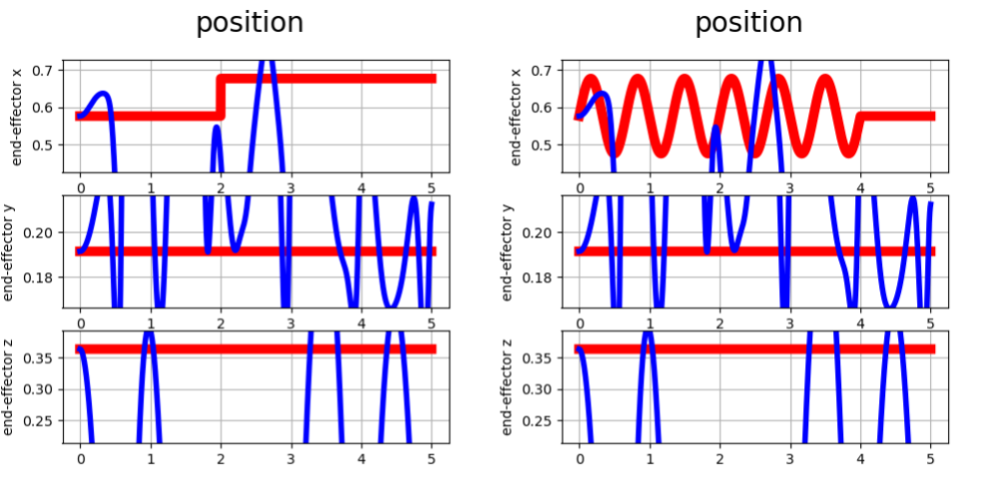
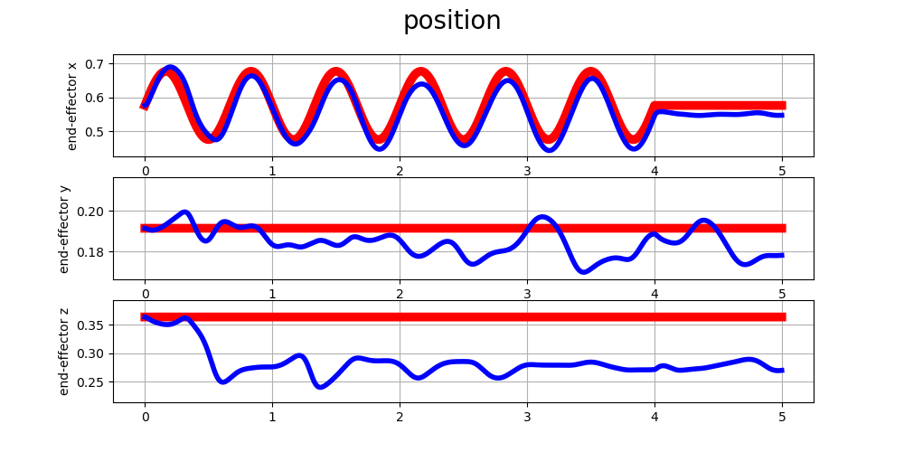
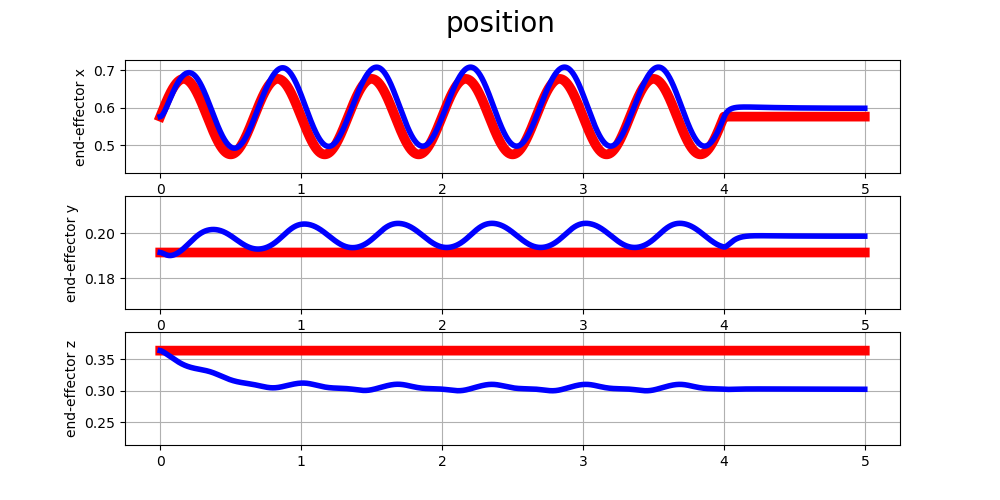
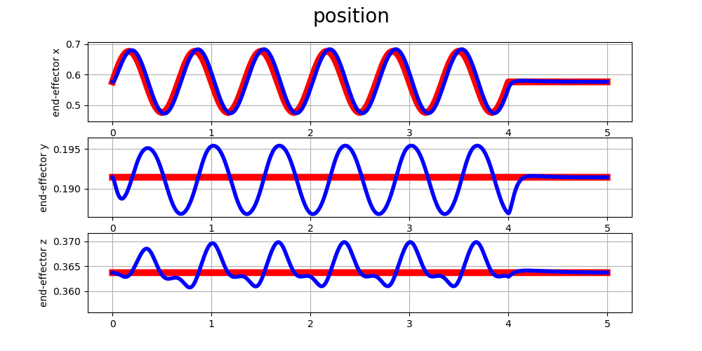
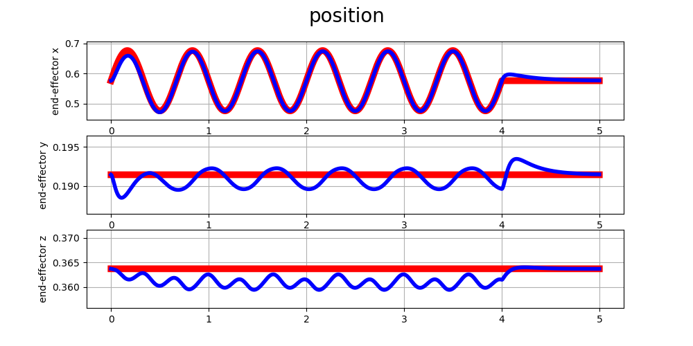
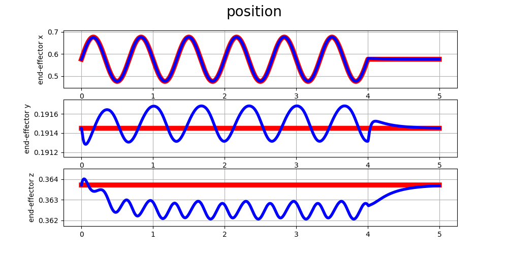
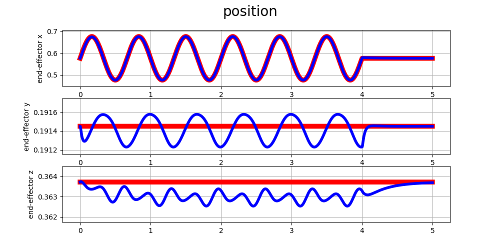
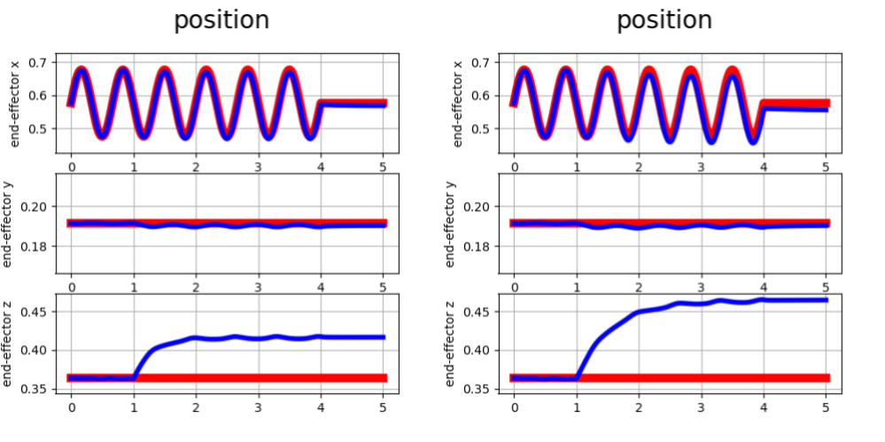

## LAB 3: Task Space Motion Control
## José Yecid Moreno Villamizar : 11195127

---

## **1. Decentralized control (Lecture G0)**
## 1.1 , 1.2 - Generate sinusoidala and step reference 

Para a geração das referencias foi usado o mesmo conceito em [LAB 2, Section 1.1 and Section 1.2](../Relatorio%202/README.md), usando a posição atual como origem e deslocando de acordo ao tipo de sinal, o deslocamento para a pocisção $\mathbf{p^{d}}$, velocidade $\mathbf{\dot p^{d}}$ e aceleração $\mathbf{\ddot p^{d}}$ são definidos da seguinte forma:

$$\mathbf{p^{d}} =  \mathbf{p_0}+ \mathbf{A} \cdot \sin\left( \mathbf{\omega} \cdot t + \mathbf{\phi}\right)$$
$$\mathbf{\dot p^{d}} = \frac{d}{dt}\left(
    \mathbf{p_0}+\mathbf{A} \cdot \sin \left(\mathbf{\omega} * t  + \mathbf{\phi}\right)
    \right) = 
\mathbf{A} \cdot \mathbf{\omega} \cdot  \cos \left(\mathbf{\omega}\cdot t + \mathbf{\phi} \right)$$
$$\mathbf{\ddot p^{d}}\frac{d}{dt}\left(
    \mathbf{A} \cdot \mathbf{\omega} \cdot  \cos \left(\mathbf{\omega}\cdot t  + \mathbf{\phi} \right)
    \right) = 
-\mathbf{A} \cdot \mathbf{\omega}^{2} \cdot  \sin \left(\mathbf{\omega}\cdot t  + \mathbf{\phi} \right)$$

Aonde $\mathbf{\omega} = 2 \cdot pi \cdot \mathbf{freq}$, as linhas vermelhas da figura embaixo representam o resultado final da trajetória gerada para a posição desejada no extremo do braço.

## 1.4 - Cartesian Space PD control

Após aplicar um controlador PD convencional no f-atuador, observamos que o seguimento de trajetória é relativamente aceitável, mas não é o máximo que se pode melhorar, alem da posição no eixo **z**, que tem um deslocamento negativo devido a a força que a gravidade faz sobre o elo final.

## 1.5 - Cartesian Space PD control - postural task

A tarefa de postura simplesmente faz uma tentativa e evitar que os atuadores fiquem com movimentos aleatorios, esto é solucionado colocando molas virtuais em cada um dos atuadores, da seginte forma:

$$\tau_0 = \mathbf{K_q}(q_0-q) - \mathbf{D_q \dot q}$$
$$N = I_{6 \times 6} - J^{T} J^{T\#}$$
$$\tau = \tau_{PD} + N\cdot \tau_0$$

Aonde $\mathbf{K_q}$ e $\mathbf{D_q}$ são as constantes de rigidez e amortecimento das juntas, dando como resultado um comportamento mais suave, pois a mola virtual não deixa que o robô perca a postura inicial $\mathbf{q_0}$, o termo $N$ é a projeção do $J$ no espaço nulo.

## 1.6 - Cartesian Space PD control + Gravity Compensation

Como já sabemos em aulas anteriores o compensador de gravidade simplesmente soma a força exercida pela gravidade em cada junta, tirando o deslocamento constante na posição atual com a desejada.

## 1.7 - Cartesian PD control + Gravity Compensation + Feed-Forward term

Para aplicar os termos de feed-foward num controle convencional, precisamos da matriz $\mathbf{M}$, mas como estamos no espaço nulo precisamos projetar esta matriz, usando o termo $\mathbf{\Lambda}$ que é calculado da seguinte forma:

$$\mathbf{\Lambda} = (J \times M \times J^{T})^{-1}$$

O resultado é uma antecipação ao movimento do robô para compensar usando o modelo, e deixando que o controlador PD faça um ajuste mais fino.

## **2 Centralized task space control (Lecture H0)**

## 2.1 - Cartesian space inverse dynamics

Aplicando a dinâmica inversa no espaço nulo obtemos melhores resultados, pois logramos um desacople das juntas do braço, compensando as forças propagas no sistema, é notável que as posições **y** e **z** apresentam deslocamentos, mas sua magnitude é quase depreciável

## 2.2 - Cartesian space inverse dynamics - simplified

É a mesma abordagem anterior, a única diferença é o custo computacional, pois evita o cálculo de $\mathbf{\dot J}$ e $\mathbf{J^{T\square}}$

## 2.3 - External Force: 
Quando uma força externa é aplicada no eixo **z** este é deslocado ao sentido da força, este comportamento é devido à mola virtual implementada no espaço de tarefas, quando a constante de esta mola é maior, o robô tenta fazer mais força oposta para compensar o deslocamento, na figura de embaixo, a constante da esquerda é maior do que a direita.

